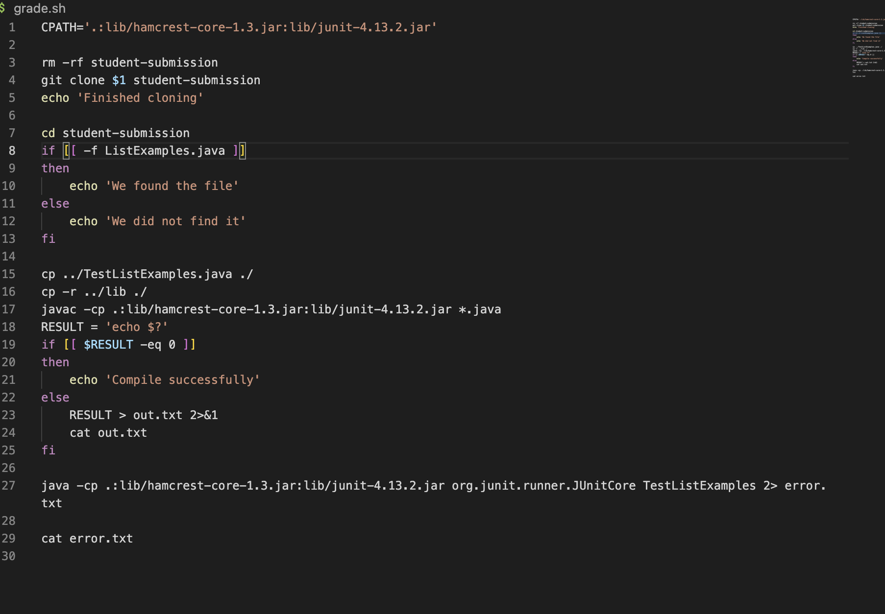

# Lab Report 5
In this lab, I will show my finished grade.sh and demostrate how it works on different files. 

## bash script
This is what my bash script looks like after I finished:


It has the following funcitons:
1. Clone the repository of the student submission to a directory name. 


2. Check that the student code has the correct file submitted, and also give correct messages.


3. Get the student code and the test file into the same directory using the ```cp``` command.


4. Compile the test and student's code with the appropriate classpath commands. Also, give correct messages if either compilation is successful or fails.
 


5. Run the tests and report the grade or the error messages based on the Junit output. 


## Examples
I tried several example files to show that the grade.sh works. 
I first typed ```bash grade.sh``` and copied ```https://github.com/ucsd-cse15l-f22/list-methods-corrected``` into the terminal, and the output I reveived is as follows:

It shows that the desired file is found in the student's submission, the file successully compiled, and the test all passed. 

Then I tried a different submission: ```https://github.com/ucsd-cse15l-f22/list-methods-compile-error``` into the terminal. The screenshot below is the output I got:

It shows that the file is found but could not successfully compiled because of an syntax error in the line ```result.add(0, s)```. It also prints out the error messages in the terminal. 

I also tried the submission ```https://github.com/ucsd-cse15l-f22/list-methods-filename```. It also as an error in it.

The messages printed out in the terminal shows that the file name cannot not be found, meaning that in the file name that the student submitted does not match the required file name. 

Overall, the bash script gives the right output for several different student's submissions. 
